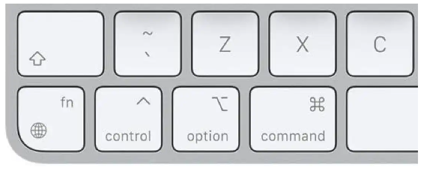
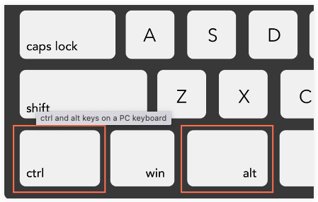
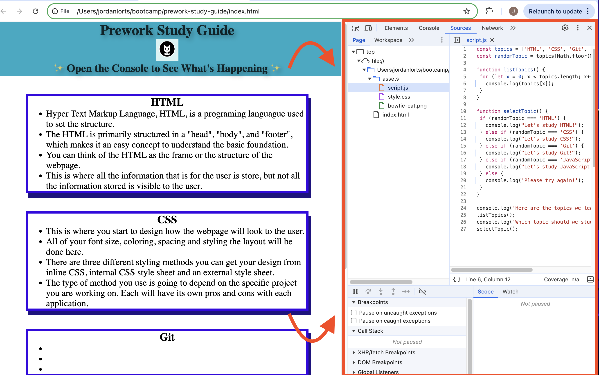
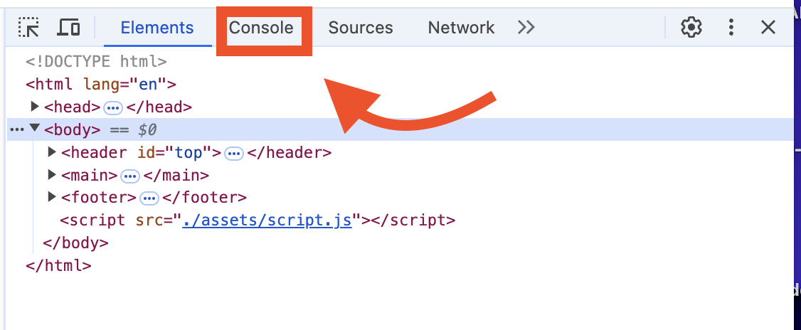

# prework-study-guide
A study guide for coding Bootcamp prework

## Description

Provide a short description explaining the what, why, and how of your project. Use the following questions as a guide:

- What was your motivation? The study guide was created to help arange and streamline keypoints for each of the four topics covered in the Bootcamp prework. 
- Why did you build this project? To create a webpage that has a localized set of a few notabel deatails on each of the concepts in the prework. On a personal reason as to why, I chose to do this on to get through it to prove to myself I can learn this no matter how hard it might be.
- What problem does it solve? The amount of new information given AND used by students can be an overwhelming amount. By consoledating all of the topics into four main categories, providing key notes for each, this allows for a more organized approach when diving into a new field.
- What did you learn? With the amount of pull requests I had I learned alot about checking "git status", renaming files, moving files, my origin being ahead of my local and my local being ahead of my main. Struggling through finding the right branch to work in helped though; Now I have a better understanding of how people will interact with your code through branches, pulls and commits. Learnign about Github and how it interacts with the terminal was something I think will be used for the rest of my career. I learned alot about the basics of a few different coding languages, when and how to use them. I am sure I will be learning alot more as we continue through Bootcamp.

## Table of Contents (Optional)

If your README is long, add a table of contents to make it easy for users to find what they need.

- [Installation](#installation)
- [Usage](#usage)
- [Credits](#credits)
- [License](#license)

## Installation

What are the steps required to install your project? Provide a step-by-step description of how to get the development environment running.

## Usage
 
- The Study Guide allows for each group of notes to be viewed with an organized approach on Chrome. 
  
- If you are unsure of where to start, open Chrome DevTools by pressing Command+Option+I (MacOS, found on 
either side of the space bar) or Control+Shift+I (Windows, found in the bottom left of most keyboards). 
  
 
- This is going to open up a control panel for you (this is how you can close DevTools as well) on the right 
  hand side of the webpage. 

- From there you will click on "console" on the top menu bar. You should see a dropdown of a few bullet points
 this is where we will find our topics to study. They all have a suggestion on which one you should start to 
 study first.

## Credits

List your collaborators, if any, with links to their GitHub profiles.

If you used any third-party assets that require attribution, list the creators with links to their primary web presence in this section.

If you followed tutorials, include links to those here as well.

## License

The last section of a high-quality README file is the license. This lets other developers know what they can and cannot do with your project. If you need help choosing a license, refer to [https://choosealicense.com/](https://choosealicense.com/).

---

🏆 The previous sections are the bare minimum, and your project will ultimately determine the content of this document. You might also want to consider adding the following sections.

## Badges

Badges aren't necessary, but they demonstrate street cred. Badges let other developers know that you know what you're doing. Check out the badges hosted by [shields.io](https://shields.io/). You may not understand what they all represent now, but you will in time.

## Features

If your project has a lot of features, list them here.

## How to Contribute

If you created an application or package and would like other developers to contribute to it, you can include guidelines for how to do so. The [Contributor Covenant](https://www.contributor-covenant.org/) is an industry standard, but you can always write your own if you'd prefer.

## Tests

Go the extra mile and write tests for your application. Then provide examples on how to run them here.